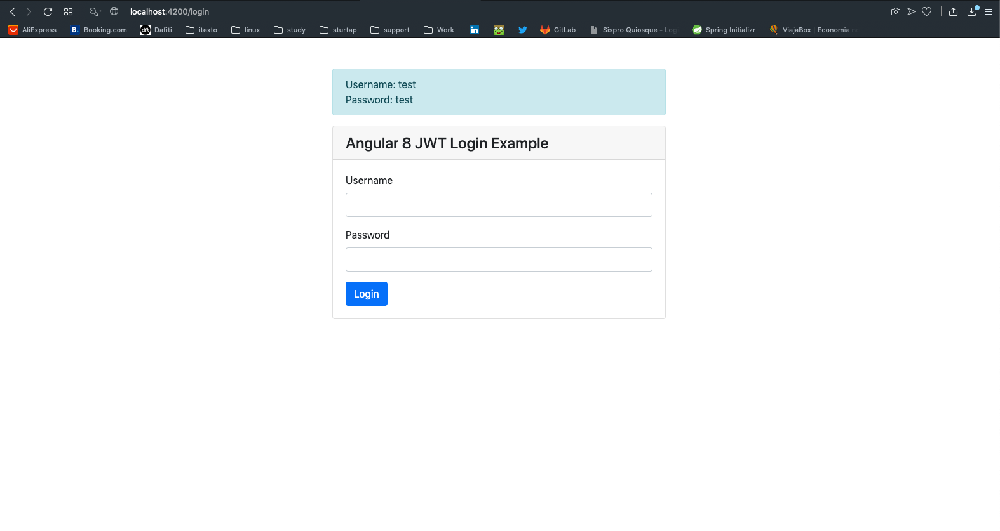

# ComponentsBoostrapp

## Getting Started

Super simple Angular app

## Get the Code
```
git clone https://github.com/Ricardolv/components-boostrapp.git
cd components-boostrapp
npm i 
```
## Development server
Run `ng serve -o`

